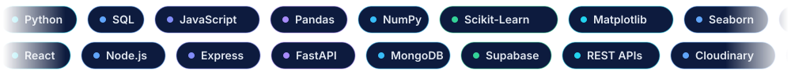
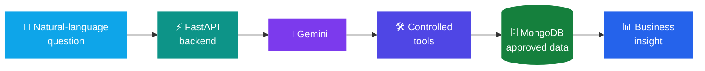
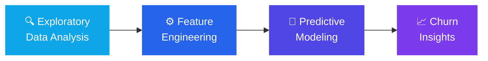
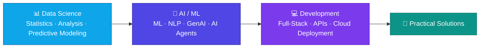
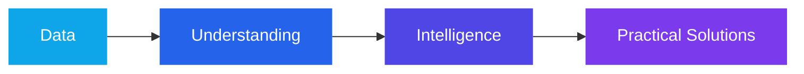

<!-- ═══════════════════════ HERO ═══════════════════════ -->
<div align="center">

<!-- Animated hero (file: assets/hero.svg) -->
<a href="https://github.com/paraskosambe-web">
  
</a>

<br/>


<br/><br/>

<!-- ═══════════════════════ NAVIGATION ═══════════════════════ -->
<a href="#about"></a>
<a href="#projects"></a>
<a href="#stack"></a>
<a href="#analytics"></a>
<a href="#roadmap"></a>
<a href="#contact"></a>

<br/><br/>

<!-- ═══════════════════════ SOCIAL BUTTONS ═══════════════════════ -->
<a href="mailto:paraskosambe@gmail.com"></a>
<a href="https://www.linkedin.com/in/paras-kosambe"></a>
<a href="https://www.instagram.com/paras.arts.3313"></a>
<a href="https://github.com/paraskosambe-web?tab=repositories"></a>

<br/><br/>

<!-- Animated skills marquee (file: assets/skills-marquee.svg) -->


</div>


<!-- ═══════════════════════ ABOUT ═══════════════════════ -->
<a id="about"></a>

## 👨‍💻 About Me

<table>
<tr>
<td width="55%" valign="top">

### Turning data into decisions, and ideas into products.

I'm a **B.Sc. Computer Science student** building toward a career as a **Data Scientist** with strong **AI/ML and software engineering** skills. I like working across the whole pipeline: cleaning and exploring data, training predictive models, and shipping the result as a real application.

My workflow is simple:

> **Learn → Build → Analyze → Improve**

I'd rather understand *how* tools fit together to solve a real problem than just collect buzzwords. Outside of code, I'm a **graphite, charcoal and digital artist**, and that creative side shapes how I design clean, user-friendly products.

</td>
<td width="45%" valign="top">

```python
class Paras:
    education  = "B.Sc. Computer Science"
    roles      = ["Aspiring Data Scientist",
                  "AI/ML Enthusiast",
                  "Full-Stack Developer"]
    languages  = ["Python", "SQL", "JavaScript"]
    focus      = ["Data Science", "ML", "NLP",
                  "Generative AI", "AI Agents"]
    creative   = "Graphite · Charcoal · Digital Art"
    philosophy = "Learn → Build → Analyze → Improve"

    def open_to(self):
        return ["Internships", "Collaborations",
                "Real-world data problems"]
```

</td>
</tr>
</table>

<div align="center">

| 📊 **Data-Driven** | 🤖 **AI-Focused** | 💻 **Builder at Heart** |
|:---:|:---:|:---:|
| EDA, feature engineering and predictive modeling with the Python data stack | NLP, Generative AI and AI agents that answer questions in plain language | Full-stack apps with React, Node.js, Express, FastAPI and databases |

</div>

<br/>

<div align="center">


</div>


<!-- ═══════════════════════ FOCUS ═══════════════════════ -->
## 🧠 What I'm Focused On

<div align="center">

| 📊 **Data Science** | 🤖 **AI & Machine Learning** | 💻 **Development** |
|:---:|:---:|:---:|
| Python • Pandas • NumPy | ML • NLP • Generative AI | React • Node.js • Express |
| Statistics • EDA | AI Agents • Agentic AI | FastAPI • REST APIs |
| Feature Engineering | Predictive Modeling | Full-Stack Apps |

| 🗄️ **Data & Databases** | ☁️ **Tools & Platforms** | 🎨 **Creative Work** |
|:---:|:---:|:---:|
| SQL • MongoDB • Supabase | Git • GitHub | Sketching • Digital Art |
| Data Modeling | Cloud Technologies | Portfolio Development |

</div>


<!-- ═══════════════════════ PROJECTS ═══════════════════════ -->
<a id="projects"></a>

## 🚀 Featured Projects

<div align="center">

<a href="https://github.com/paraskosambe-web/paras-arts">
  
</a>
<a href="https://github.com/paraskosambe-web/paras-arts-ai-agent">
  
</a>
<a href="https://github.com/paraskosambe-web/bcg-x-data-science-job-simulation">
  
</a>

</div>

<br/>

### 🎨 Paras Arts — *Digital Art Portfolio & Custom Sketch Ordering System*

A full-stack platform to showcase artwork, manage custom sketch orders, track order status, and run everything through an admin management system.

- 🖼️ Artwork portfolio and gallery
- 📝 Custom sketch order placement and **order status tracking**
- 🛡️ Admin dashboard for managing orders and content

&nbsp;
&nbsp;
<picture><source media="(prefers-color-scheme: dark)" srcset="https://cdn.simpleicons.org/express/ffffff"></picture>&nbsp;
&nbsp;


<a href="https://github.com/paraskosambe-web/paras-arts"></a>


<br/><br/>

### 🤖 Paras Arts AI Data Agent — *AI-Powered Business Data Analysis*

An AI agent that lets approved business data from the Paras Arts platform be queried and analyzed in **natural language**, using controlled tools for business insights and data operations.



&nbsp;
&nbsp;
&nbsp;


<a href="https://github.com/paraskosambe-web/paras-arts-ai-agent"></a>


<br/><br/>

### 📊 BCG X Data Science Job Simulation — *Customer Churn Analysis for PowerCo*

Customer churn analysis for **PowerCo**, built as part of the **BCG X Data Science Virtual Experience**, covering exploratory data analysis, feature engineering, and predictive modeling.



&nbsp;
<picture><source media="(prefers-color-scheme: dark)" srcset="https://cdn.simpleicons.org/pandas/ffffff"></picture>&nbsp;
&nbsp;
&nbsp;
&nbsp;


<a href="https://github.com/paraskosambe-web/bcg-x-data-science-job-simulation"></a>


<!-- ═══════════════════════ TECH STACK ═══════════════════════ -->
<a id="stack"></a>

## 🛠️ Tech Stack

<div align="center">

**🐍 Languages**

<table align="center"><tr>
<td align="center" width="100"><br/><sub><b>Python</b></sub></td>
<td align="center" width="100"><br/><sub><b>SQL</b></sub></td>
<td align="center" width="100"><br/><sub><b>JavaScript</b></sub></td>
<td align="center" width="100"><br/><sub><b>HTML5</b></sub></td>
<td align="center" width="100"><br/><sub><b>CSS3</b></sub></td>
</tr></table>

**📊 Data Science & Machine Learning**

<table align="center"><tr>
<td align="center" width="100"><picture><source media="(prefers-color-scheme: dark)" srcset="https://cdn.simpleicons.org/pandas/ffffff"></picture><br/><sub><b>Pandas</b></sub></td>
<td align="center" width="100"><br/><sub><b>NumPy</b></sub></td>
<td align="center" width="100"><br/><sub><b>Scikit-Learn</b></sub></td>
<td align="center" width="100"><br/><sub><b>Matplotlib</b></sub></td>
<td align="center" width="100"><br/><sub><b>Seaborn</b></sub></td>
<td align="center" width="100"><br/><sub><b>Gemini</b></sub></td>
</tr></table>

**⚙️ Backend & Databases**

<table align="center"><tr>
<td align="center" width="100"><br/><sub><b>MongoDB</b></sub></td>
<td align="center" width="100"><br/><sub><b>Node.js</b></sub></td>
<td align="center" width="100"><br/><sub><b>Supabase</b></sub></td>
<td align="center" width="100"><picture><source media="(prefers-color-scheme: dark)" srcset="https://cdn.simpleicons.org/express/ffffff"></picture><br/><sub><b>Express</b></sub></td>
<td align="center" width="100"><br/><sub><b>FastAPI</b></sub></td>
</tr></table>

**🌐 Frontend & Media**

<table align="center"><tr>
<td align="center" width="100"><br/><sub><b>React</b></sub></td>
<td align="center" width="100"><br/><sub><b>Cloudinary</b></sub></td>
</tr></table>

**🧰 Tools**

<table align="center"><tr>
<td align="center" width="100"><br/><sub><b>Git</b></sub></td>
<td align="center" width="100"><picture><source media="(prefers-color-scheme: dark)" srcset="https://cdn.simpleicons.org/github/ffffff"></picture><br/><sub><b>GitHub</b></sub></td>
<td align="center" width="100"><br/><sub><b>VS Code</b></sub></td>
<td align="center" width="100"><br/><sub><b>Postman</b></sub></td>
</tr></table>

</div>


<!-- ═══════════════════════ ANALYTICS ═══════════════════════ -->
<a id="analytics"></a>

## 📈 GitHub Analytics

<div align="center">


<br/>


<br/><br/>

**🗓️ Contribution Calendar**


<br/><br/>

**🐍 Contribution Snake**

<picture>
  <source media="(prefers-color-scheme: dark)" srcset="https://raw.githubusercontent.com/paraskosambe-web/paraskosambe-web/output/github-snake-dark.svg"/>
  <source media="(prefers-color-scheme: light)" srcset="https://raw.githubusercontent.com/paraskosambe-web/paraskosambe-web/output/github-snake.svg"/>
  
</picture>

</div>


<!-- ═══════════════════════ ROADMAP ═══════════════════════ -->
<a id="roadmap"></a>

## 📚 Learning Roadmap

<div align="center">


</div>



<details>
<summary><b>🏆 Certifications & Learning Areas (click to expand)</b></summary>
<br/>

Building knowledge through **AI, Machine Learning, Data Science, Cloud, and Agentic AI** certifications and hands-on programs. Areas explored so far:

- 🤖 Artificial Intelligence & Machine Learning
- ✨ Generative AI
- 🧩 Agentic AI
- 💬 Natural Language Processing
- 📊 Data Analytics
- ☁️ Cloud AI Foundations
- ⚖️ AI Ethics
- 🔮 Predictive Modeling

</details>


<!-- ═══════════════════════ BEYOND CODE ═══════════════════════ -->
## 🎨 Beyond Code

Alongside technology, I'm a **digital and sketch artist** working in **graphite, charcoal, and pencil**. My creative portfolio lives at **Paras Arts**, where art and code meet.

<div align="center">

<a href="https://www.instagram.com/paras.arts.3313"></a>
<a href="https://github.com/paraskosambe-web/paras-arts"></a>

</div>

## 🌱 What I'm Building Toward

> A **Data Scientist** with strong **AI/ML and software development** skills, while continuing to grow my creative work alongside technology.



<!-- ═══════════════════════ CONTACT ═══════════════════════ -->
<a id="contact"></a>

## 📫 Let's Connect

<div align="center">

| | |
|:---:|:---|
| 📧 **Email** | [paraskosambe@gmail.com](mailto:paraskosambe@gmail.com) |
| 💼 **LinkedIn** | [linkedin.com/in/paras-kosambe](https://www.linkedin.com/in/paras-kosambe) |
| 🎨 **Instagram** | [@paras.arts.3313](https://www.instagram.com/paras.arts.3313) |
| 💻 **GitHub** | [@paraskosambe-web](https://github.com/paraskosambe-web) |

<br/>

<a href="mailto:paraskosambe@gmail.com"></a>

<br/><br/>


</div>


