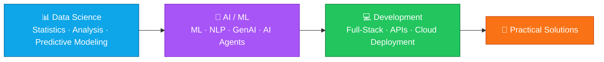
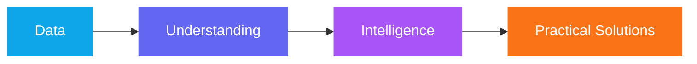

<!-- ═══════════════ HEADER ═══════════════ -->
<div align="center">


<a href="https://github.com/paraskosambe-web">
  
</a>

<br/>


<br/><br/>

<!-- ═══════════════ CONNECT BUTTONS ═══════════════ -->
<a href="mailto:paraskosambe@gmail.com"></a>
<a href="https://www.linkedin.com/in/paras-kosambe"></a>
<a href="https://www.instagram.com/paras.arts.3313"></a>
<a href="https://github.com/paraskosambe-web?tab=repositories"></a>

</div>


<!-- ═══════════════ ABOUT ═══════════════ -->
## 👨‍💻 About Me

<table>
<tr>
<td width="62%" valign="top">

I'm a **B.Sc. Computer Science student** who loves turning raw data and rough ideas into working products — from **predictive models and AI agents** to **full-stack platforms**.

My approach is simple:

> **Learn → Build → Analyze → Improve**

I care less about collecting buzzwords and more about understanding **how tools fit together** to produce useful, data-driven solutions.

- 🔭 Currently working on **AI agents** and **predictive modeling**
- 🌱 Currently learning **statistics, NLP, Generative AI & cloud deployment**
- 🎨 Sketch artist & digital creator behind **Paras Arts**
- 💬 Ask me about **Python, data analysis, FastAPI or graphite portraits**

</td>
<td width="38%" align="center" valign="middle">

```text
┌──────────────────────────┐
│  👤 Paras Kosambe        │
│  🎓 B.Sc. Computer Sci.  │
│  📍 India                │
│  🎯 Data Scientist       │
│  🧰 Python · SQL · React │
│  🎨 Art · AI · Code      │
└──────────────────────────┘
```

</td>
</tr>
</table>


<!-- ═══════════════ FOCUS ═══════════════ -->
## 🧠 What I'm Focused On

<div align="center">

| 📊 **Data Science** | 🤖 **AI & Machine Learning** | 💻 **Development** |
|:---:|:---:|:---:|
| Python • Pandas • NumPy | ML • NLP • Generative AI | React • Node.js • Express |
| Statistics • EDA | AI Agents • Agentic AI | FastAPI • REST APIs |
| Feature Engineering | Predictive Modeling | Full-Stack Apps |

| 🗄️ **Data & Databases** | ☁️ **Tools & Platforms** | 🎨 **Creative Work** |
|:---:|:---:|:---:|
| SQL • MongoDB | Git • GitHub | Sketching • Digital Art |
| Data Modeling | Cloud Technologies | Portfolio Development |

</div>


<!-- ═══════════════ PROJECTS ═══════════════ -->
## 🚀 Featured Projects

<div align="center">

<a href="https://github.com/paraskosambe-web/paras-arts">
  
</a>
<a href="https://github.com/paraskosambe-web/paras-arts-ai-agent">
  
</a>
<a href="https://github.com/paraskosambe-web/bcg-x-data-science-churn-analysis">
  
</a>

</div>

<br/>

### 🎨 Paras Arts — *Digital Art Portfolio & Custom Sketch Ordering System*

A full-stack platform to showcase artwork, manage custom sketch orders, track order status, and run everything through an admin management system.


<a href="https://github.com/paraskosambe-web/paras-arts"></a>

<br/>

### 🤖 Paras Arts AI Data Agent — *AI-Powered Business Data Analysis*

An AI agent that lets approved business data from the Paras Arts platform be queried and analyzed in **natural language**, using controlled tools for business insights and data operations.


<a href="https://github.com/paraskosambe-web/paras-arts-ai-agent"></a>

<br/>

### 📊 BCG X – Customer Churn Analysis — *Data Science Virtual Experience*

Customer churn analysis for **PowerCo**, built during the **BCG X Data Science Virtual Experience** — covering exploratory data analysis, feature engineering, and predictive modeling.


<a href="https://github.com/paraskosambe-web/bcg-x-data-science-churn-analysis"></a>


<!-- ═══════════════ SKILLS ═══════════════ -->
## 🛠️ Tech Stack

<div align="center">

**Languages & Data**


**Data Science & AI**


**Web Development**


**Tools**


</div>


<!-- ═══════════════ STATS ═══════════════ -->
## 📈 GitHub Analytics

<div align="center">


</div>

<!-- ═══════════════ SNAKE ═══════════════ -->
<div align="center">

<picture>
  <source media="(prefers-color-scheme: dark)" srcset="https://raw.githubusercontent.com/paraskosambe-web/paraskosambe-web/output/github-snake-dark.svg"/>
  <source media="(prefers-color-scheme: light)" srcset="https://raw.githubusercontent.com/paraskosambe-web/paraskosambe-web/output/github-snake.svg"/>
  
</picture>

</div>


<!-- ═══════════════ LEARNING ═══════════════ -->
## 📚 Learning Roadmap



<details>
<summary><b>🏆 Certifications & Learning Areas (click to expand)</b></summary>
<br/>

Building knowledge through **AI, Machine Learning, Data Science, Cloud, and Agentic AI** certifications and hands-on programs. Areas explored so far:

- 🤖 Artificial Intelligence & Machine Learning
- ✨ Generative AI
- 🧩 Agentic AI
- 💬 Natural Language Processing
- 📊 Data Analytics
- ☁️ Cloud AI Foundations
- ⚖️ AI Ethics
- 🔮 Predictive Modeling

</details>


<!-- ═══════════════ BEYOND CODE ═══════════════ -->
## 🎨 Beyond Code

Alongside technology, I'm a **digital and sketch artist** working in **graphite, charcoal, and pencil**. My creative portfolio lives at **Paras Arts**, where art and code meet.

<div align="center">

<a href="https://www.instagram.com/paras.arts.3313"></a>
<a href="https://github.com/paraskosambe-web/paras-arts"></a>

</div>

## 🌱 What I'm Building Toward

> A **Data Scientist** with strong **AI/ML and software development** skills — while continuing to grow my creative work alongside technology.



<!-- ═══════════════ CONTACT ═══════════════ -->
## 📫 Let's Connect

<div align="center">

| | |
|:---:|:---|
| 📧 **Email** | [paraskosambe@gmail.com](mailto:paraskosambe@gmail.com) |
| 💼 **LinkedIn** | [linkedin.com/in/paras-kosambe](https://www.linkedin.com/in/paras-kosambe) |
| 🎨 **Instagram** | [@paras.arts.3313](https://www.instagram.com/paras.arts.3313) |
| 💻 **GitHub** | [@paraskosambe-web](https://github.com/paraskosambe-web) |

<br/>

<a href="mailto:paraskosambe@gmail.com"></a>

<br/><br/>


</div>


