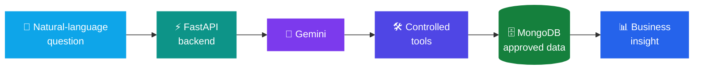
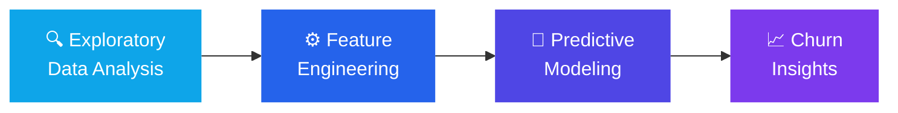
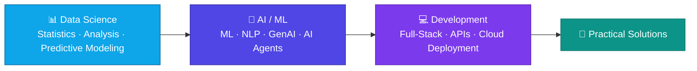
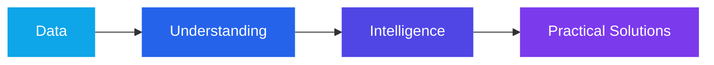

<!-- ═══════════════════════ HERO ═══════════════════════ -->
<div align="center">

<a href="https://paras-kosambe.vercel.app/" title="paras-kosambe.vercel.app">
  <picture>
  <source media="(max-width: 600px)" srcset="./assets/hero-mobile.svg?v=5">
  
</picture>
</a>

<br/>

<p>


</p>


<br/><br/>

<!-- NAVIGATION -->
<p>
<a href="https://paras-kosambe.vercel.app/"></a>
<a href="#about"></a>
<a href="#projects"></a>
<a href="#stack"></a>
<a href="#analytics"></a>
<a href="#roadmap"></a>
<a href="#contact"></a>
</p>

<!-- SOCIAL -->
<p>
<a href="mailto:paraskosambe@gmail.com" title="Email · paraskosambe@gmail.com"></a>
<a href="https://www.linkedin.com/in/paras-kosambe" title="LinkedIn · in/paras-kosambe"></a>
<a href="https://www.instagram.com/paras.arts.3313/" title="Instagram · @paras.arts.3313"></a>
<a href="https://github.com/paraskosambe-web?tab=repositories" title="Repositories"></a>
</p>

<br/>


</div>


<!-- ═══════════════════════ ABOUT ═══════════════════════ -->
<a id="about"></a>

<h2 align="center">👨‍💻 About Me</h2>

<div align="center">

**Turning data into decisions, and ideas into products.**

</div>

I'm a **B.Sc. Computer Science student** building toward a career as a **Data Scientist** with strong **AI/ML and software engineering** skills. I like working across the whole pipeline: cleaning and exploring data, training predictive models, and shipping the result as a real application.

<div align="center">

> **Learn → Build → Analyze → Improve**

</div>

I'd rather understand *how* tools fit together to solve a real problem than just collect buzzwords. Outside of code, I'm a **graphite, charcoal and digital artist**, and that creative side shapes how I design clean, user-friendly products.

<div align="center">


</div>

<details>
<summary><b>🐍 The same thing, as code (click to expand)</b></summary>

```python
class Paras:
    education  = "B.Sc. Computer Science"
    roles      = ["Aspiring Data Scientist",
                  "AI/ML Enthusiast",
                  "Full-Stack Developer"]
    languages  = ["Python", "SQL", "JavaScript"]
    focus      = ["Data Science", "ML", "NLP",
                  "Generative AI", "AI Agents"]
    creative   = "Graphite · Charcoal · Digital Art"
    philosophy = "Learn → Build → Analyze → Improve"

    def open_to(self):
        return ["Internships", "Collaborations",
                "Real-world data problems"]
```

</details>

<div align="center">

**📊 Data-Driven** — EDA, feature engineering and predictive modeling with the Python data stack<br/>
**🤖 AI-Focused** — NLP, Generative AI and AI agents that answer questions in plain language<br/>
**💻 Builder at Heart** — Full-stack apps with React, Node.js, Express, FastAPI and databases

<br/>

<p>


</p>

</div>


<!-- ═══════════════════════ FOCUS ═══════════════════════ -->
<h2 align="center">🧠 What I'm Focused On</h2>

<div align="center">

<table>
<tr>
<td align="center" width="50%">📊 <b>Data Science</b><br/><sub>Python • Pandas • NumPy<br/>Statistics • EDA<br/>Feature Engineering</sub></td>
<td align="center" width="50%">🤖 <b>AI &amp; Machine Learning</b><br/><sub>ML • NLP • Generative AI<br/>AI Agents • Agentic AI<br/>Predictive Modeling</sub></td>
</tr>
<tr>
<td align="center">💻 <b>Development</b><br/><sub>React • Node.js • Express<br/>FastAPI • REST APIs<br/>Full-Stack Apps</sub></td>
<td align="center">🗄️ <b>Data &amp; Databases</b><br/><sub>SQL • MongoDB • Supabase<br/>Data Modeling</sub></td>
</tr>
<tr>
<td align="center">☁️ <b>Tools &amp; Platforms</b><br/><sub>Git • GitHub<br/>Cloud Technologies</sub></td>
<td align="center">🎨 <b>Creative Work</b><br/><sub>Sketching • Digital Art<br/>Portfolio Development</sub></td>
</tr>
</table>

</div>


<!-- ═══════════════════════ LIVE PORTFOLIO (single section) ═══════════════════════ -->
<h2 align="center">🌐 Live Portfolio</h2>

<div align="center">

Everything in one place — projects, skills, experience, certifications, resume and my art gallery, all deployed live.

<a href="https://paras-kosambe.vercel.app/" title="paras-kosambe.vercel.app">
  
</a>

<br/>

<a href="https://paras-kosambe.vercel.app/" title="Live portfolio website"></a>
<a href="https://paras-kosambe.vercel.app/projects" title="All projects"></a>
<a href="https://paras-kosambe.vercel.app/resume" title="View resume"></a>
<a href="https://www.instagram.com/paras.arts.3313/" title="Art gallery"></a>

<br/><br/>

**Jump straight to a page**

<p>
<a href="https://paras-kosambe.vercel.app/about"></a>
<a href="https://paras-kosambe.vercel.app/projects"></a>
<a href="https://paras-kosambe.vercel.app/skills"></a>
<a href="https://paras-kosambe.vercel.app/experience"></a>
<a href="https://paras-kosambe.vercel.app/certifications"></a>
<a href="https://paras-kosambe.vercel.app/achievements"></a>
<a href="https://paras-kosambe.vercel.app/resume"></a>
</p>

</div>


<!-- ═══════════════════════ PROJECTS ═══════════════════════ -->
<a id="projects"></a>

<h2 align="center">🚀 Featured Projects</h2>

<div align="center">

<a href="https://github.com/paraskosambe-web?tab=repositories">
  <picture>
  <source media="(max-width: 600px)" srcset="./assets/repo-cards-mobile.svg?v=2">
  
</picture>
</a>

</div>

<br/>

### 🎨 Paras Arts — *Digital Art Portfolio & Custom Sketch Ordering System*

A full-stack platform to showcase artwork, manage custom sketch orders, track order status, and run everything through an admin management system.

- 🖼️ Artwork portfolio and gallery
- 📝 Custom sketch order placement and **order status tracking**
- 🛡️ Admin dashboard for managing orders and content

<div align="center">

 
 
<picture><source media="(prefers-color-scheme: dark)" srcset="https://cdn.simpleicons.org/express/ffffff"></picture> 
 


<br/><br/>

<p>
<a href="https://github.com/paraskosambe-web/paras-arts-website"></a>
<a href="https://paras-kosambe.vercel.app/projects/paras-arts-digital-art-portfolio-custom-sketch-ordering-system"></a>
</p>

<p>


</p>

</div>

<br/>

### 🤖 Paras Arts AI Data Agent — *AI-Powered Business Data Analysis*

An AI agent that lets approved business data from the Paras Arts platform be queried and analyzed in **natural language**, using controlled tools for business insights and data operations.


```mermaid
flowchart LR
    Q["💬 Natural-language<br/>question"] --> A["⚡ FastAPI<br/>backend"]
    A --> G["🤖 Gemini"]
    G --> T["🛠️ Controlled<br/>tools"]
    T --> D[("🗄️ MongoDB<br/>approved data")]
    D --> I["📊 Business<br/>insight"]
    style Q fill:#0ea5e9,stroke:none,color:#fff
    style A fill:#0d9488,stroke:none,color:#fff
    style G fill:#7c3aed,stroke:none,color:#fff
    style T fill:#4f46e5,stroke:none,color:#fff
    style D fill:#15803d,stroke:none,color:#fff
    style I fill:#2563eb,stroke:none,color:#fff
```

<div align="center">

 
 
 


<br/><br/>

<p>
<a href="https://github.com/paraskosambe-web/paras-arts-ai-agent"></a>
<a href="https://paras-kosambe.vercel.app/projects/paras-arts-ai-data-agent"></a>
</p>

<p>


</p>

</div>

<br/>

### 🧪 InsightForge — *Interactive Data Workspace*

An interactive data workspace that helps users upload, explore, analyze, and understand datasets through a modern data-science-focused interface.

<div align="center">

 
 


<br/><br/>

<p>
<a href="https://github.com/paraskosambe-web/InsightForge-Data-Workspace"></a>
<a href="https://paras-kosambe.vercel.app/projects/insightforge-data-workspace"></a>
</p>

</div>

<br/>

### 📊 BCG X Data Science Job Simulation — *Customer Churn Analysis for PowerCo*

Customer churn analysis for **PowerCo**, built as part of the **BCG X Data Science Virtual Experience**, covering exploratory data analysis, feature engineering, and predictive modeling.


```mermaid
flowchart LR
    A["🔍 Exploratory<br/>Data Analysis"] --> B["⚙️ Feature<br/>Engineering"] --> C["🤖 Predictive<br/>Modeling"] --> D["📈 Churn<br/>Insights"]
    style A fill:#0ea5e9,stroke:none,color:#fff
    style B fill:#2563eb,stroke:none,color:#fff
    style C fill:#4f46e5,stroke:none,color:#fff
    style D fill:#7c3aed,stroke:none,color:#fff
```

<div align="center">

 
<picture><source media="(prefers-color-scheme: dark)" srcset="https://cdn.simpleicons.org/pandas/ffffff"></picture> 
 
 
 


<br/><br/>

<p>
<a href="https://github.com/paraskosambe-web/bcg-x-data-science-job-simulation"></a>
<a href="https://paras-kosambe.vercel.app/certifications"></a>
</p>

<p>

</p>

</div>


<!-- ═══════════════════════ TECH STACK ═══════════════════════ -->
<a id="stack"></a>

<h2 align="center">🛠️ Tech Stack</h2>

<div align="center">

<picture>
  <source media="(max-width: 600px)" srcset="./assets/tech-stack-mobile.svg?v=1">
  
</picture>

</div>

<!-- ═══════════════════════ ANALYTICS ═══════════════════════ -->
<a id="analytics"></a>

<h2 align="center">📈 GitHub Analytics</h2>

<div align="center">

**📊 GitHub at a Glance**

<a href="https://github.com/paraskosambe-web">
  <picture>
  <source media="(max-width: 600px)" srcset="./assets/github-stats-mobile.svg?v=1">
  
</picture>
</a>

<sub>Contributions · commits · repos · stars · streaks · top language — one card, one colour per metric.</sub>

<br/><br/>

**🗣️ Language Mix** <sub>(each language in its own colour)</sub>

<picture>
  <source media="(max-width: 600px)" srcset="./assets/language-mix-mobile.svg?v=4">
  
</picture>

<br/><br/>

**🗓️ Contribution Calendar**

<picture>
  <source media="(max-width: 600px)" srcset="./assets/contribution-calendar-mobile.svg?v=2">
  
</picture>

<br/><br/>

**⏰ When I Commit** <sub>(Asia/Kolkata · UTC+5:30)</sub>

<picture>
  <source media="(max-width: 600px)" srcset="./assets/commit-hours-mobile.svg?v=2">
  
</picture>

<br/>

**🐍 Contribution Snake**

<picture>
  <source media="(prefers-color-scheme: dark)" srcset="https://raw.githubusercontent.com/paraskosambe-web/paraskosambe-web/output/github-snake-dark.svg"/>
  <source media="(prefers-color-scheme: light)" srcset="https://raw.githubusercontent.com/paraskosambe-web/paraskosambe-web/output/github-snake.svg"/>
  
</picture>

<sub>Generated by <code>.github/workflows/snake.yml</code> → committed to the <code>output</code> branch every 12 h.</sub>

<br/><br/>

**🏅 Quick Facts**

<table align="center">
<tr>
<td align="center">🏫 <b>Education</b><br/><sub>B.Sc. Computer Science</sub></td>
<td align="center">📍 <b>Based in</b><br/><sub>Mumbai, India</sub></td>
</tr>
<tr>
<td align="center">🕒 <b>Timezone</b><br/><sub>IST · UTC+5:30</sub></td>
<td align="center">💼 <b>Open to</b><br/><sub>Internships &amp; Collabs</sub></td>
</tr>
<tr>
<td align="center">🧠 <b>Focus</b><br/><sub>Data Science · AI/ML</sub></td>
<td align="center">🎨 <b>Off-screen</b><br/><sub>Graphite &amp; charcoal art</sub></td>
</tr>
</table>

</div>


<!-- ═══════════════════════ ROADMAP ═══════════════════════ -->
<a id="roadmap"></a>

<h2 align="center">📚 Learning Roadmap</h2>

<div align="center">


</div>


```mermaid
flowchart LR
    A["📊 Data Science<br/>Statistics · Analysis · Predictive Modeling"] --> B["🤖 AI / ML<br/>ML · NLP · GenAI · AI Agents"]
    B --> C["💻 Development<br/>Full-Stack · APIs · Cloud Deployment"]
    C --> D["🚀 Practical Solutions"]
    style A fill:#0ea5e9,stroke:#0369a1,color:#fff
    style B fill:#4f46e5,stroke:#3730a3,color:#fff
    style C fill:#7c3aed,stroke:#5b21b6,color:#fff
    style D fill:#0d9488,stroke:#0f766e,color:#fff
```

<details>
<summary><b>🏆 Certifications & Learning Areas (click to expand)</b></summary>
<br/>

Building knowledge through **AI, Machine Learning, Data Science, Cloud, and Agentic AI** certifications and hands-on programs. Areas explored so far:

- 🤖 Artificial Intelligence & Machine Learning
- ✨ Generative AI
- 🧩 Agentic AI
- 💬 Natural Language Processing
- 📊 Data Analytics
- ☁️ Cloud AI Foundations
- ⚖️ AI Ethics
- 🔮 Predictive Modeling

**Job simulations completed:** BCG X · Tata (GenAI Data Analytics) · British Airways — see them all on my [portfolio certifications page](https://paras-kosambe.vercel.app/certifications).

</details>


<!-- ═══════════════════════ BEYOND CODE ═══════════════════════ -->
<h2 align="center">🎨 Beyond Code</h2>

<div align="center">

Alongside technology, I'm a **digital and sketch artist** working in **graphite, charcoal, and pencil**. My creative portfolio lives at **Paras Arts**, where art and code meet.

<br/><br/>

<p>
<a href="https://www.instagram.com/paras.arts.3313/"></a>
<a href="https://github.com/paraskosambe-web/paras-arts-website"></a>
<a href="https://paras-kosambe.vercel.app/"></a>
</p>

</div>

<h2 align="center">🌱 What I'm Building Toward</h2>

<div align="center">

> A **Data Scientist** with strong **AI/ML and software development** skills, while continuing to grow my creative work alongside technology.

</div>


```mermaid
flowchart LR
    D["Data"] --> U["Understanding"] --> I["Intelligence"] --> P["Practical Solutions"]
    style D fill:#0ea5e9,color:#fff,stroke:none
    style U fill:#2563eb,color:#fff,stroke:none
    style I fill:#4f46e5,color:#fff,stroke:none
    style P fill:#7c3aed,color:#fff,stroke:none
```


<!-- ═══════════════════════ CONTACT ═══════════════════════ -->
<a id="contact"></a>

<h2 align="center">📫 Let's Connect</h2>

<div align="center">

<a href="https://paras-kosambe.vercel.app/" title="paras-kosambe.vercel.app">
  
</a>

<br/>

<table>
<tr><td>📧 <b>Email</b></td><td><a href="mailto:paraskosambe@gmail.com">paraskosambe@gmail.com</a></td></tr>
<tr><td>💼 <b>LinkedIn</b></td><td><a href="https://www.linkedin.com/in/paras-kosambe">in/paras-kosambe</a></td></tr>
<tr><td>🎨 <b>Instagram</b></td><td><a href="https://www.instagram.com/paras.arts.3313/">@paras.arts.3313</a></td></tr>
<tr><td>🌐 <b>Portfolio</b></td><td><a href="https://paras-kosambe.vercel.app/">paras-kosambe.vercel.app</a></td></tr>
<tr><td>💻 <b>GitHub</b></td><td><a href="https://github.com/paraskosambe-web">@paraskosambe-web</a></td></tr>
<tr><td>📄 <b>Resume</b></td><td><a href="https://paras-kosambe.vercel.app/resume">paras-kosambe.vercel.app<wbr/></a> <sub>/resume</sub></td></tr>
</table>

<br/>

<p>
<a href="mailto:paraskosambe@gmail.com"></a>
<a href="https://www.linkedin.com/in/paras-kosambe"></a>
</p>

<br/>


</div>


